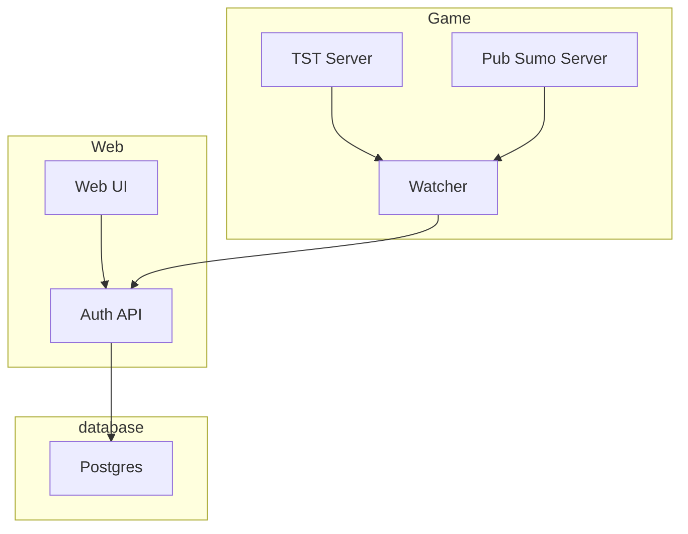

# Syntron Documentation

This documentation provides an overview of the architecture, as well as instructions for setting up and running the Syntron application, and basic documentation of the provided scripts.

## Contents

- [Syntron Documentation](#syntron-documentation)
  - [Contents](#contents)
  - [Architecture Overview](#architecture-overview)
  - [Scripts](#scripts)
  - [Setup](#setup)
    - [Prerequisites](#prerequisites)
    - [Running the Application](#running-the-application)
    - [ELK Stack](#elk-stack)
  - [Development](#development)
  - [Contributing](#contributing)
  - [Support](#support)

## Architecture Overview



- **Web UI**: The front-end user interface, written in TypeScript, interacts with the Auth API for authentication processes. It's a Next.js application that uses React for rendering, and Tailwind CSS for styling.
  
- **Auth API**: Also written in TypeScript, this handles all authentication requests and interacts directly with the Postgres database. Express.js is used as the server framework.
  
- **Watcher**: A TypeScript service that monitors interactions between the TST and Pub Sumo servers and communicates with the Auth API.
  
- **TST Server & Pub Sumo Server**: Backend servers responsible for core game logic and public summaries respectively. Shoutout to my fellow insomniac Light (https://lightron.org/) for the docker image.
  
- **Postgres**: The database used for storing user and authentication data.

## Scripts

The following scripts are located in the `scripts` directory of the project.


## Setup

The application is containerized using Docker Compose. Below are the steps to set up and run the application.

### Prerequisites

- Docker
- Docker Compose
- Node.js (for running local TypeScript setups if necessary)

### Running the Application

1. Clone the repository to your local machine.
2. Navigate to the root of the project where the `docker-compose.yml` file is located.
3. Ensure you have a `.env` file in the root directory with all the necessary environment variables set.
4. Run the following command to start all services:
   ```
   docker-compose up
   ```

### ELK Stack

The application uses an ELK (Elasticsearch, Logstash, Kibana) stack for logging purposes.

- **Access Logs**: Visit \`http://localhost:5601\` to access Kibana and view the logs.

## Development

- When developing locally, ensure all TypeScript services (Web UI, Auth API, Watcher) are compiled and up-to-date.
- Use the provided Docker setup to maintain consistency in development and production environments.

## Contributing

Contributions are welcome! Please fork the repository and submit pull requests with your proposed changes.

## Support

For any additional support or queries, please open an issue in the repository or contact me at legg.jamie@gmail.com.
